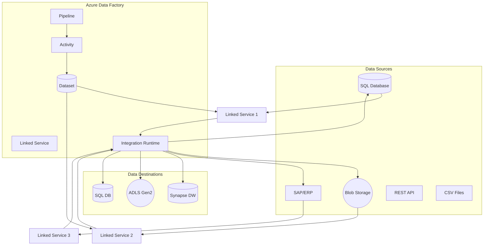
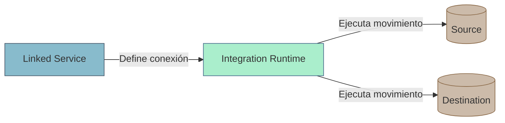
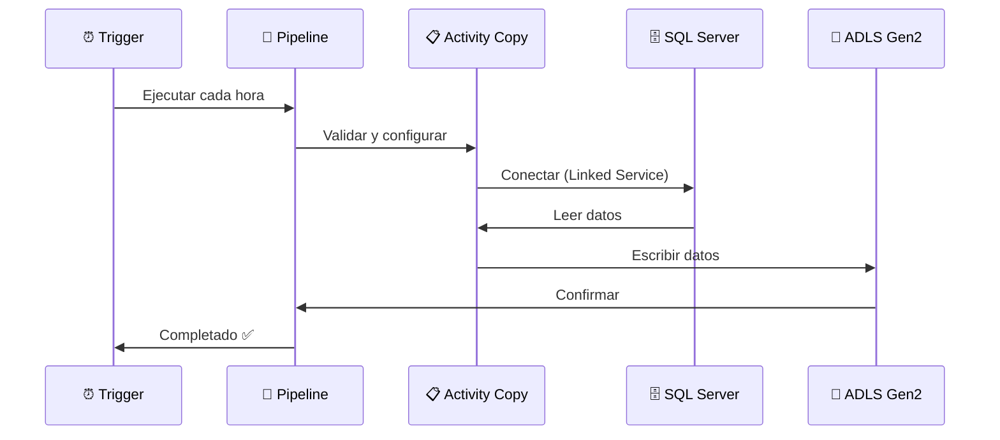

# Azure Data Factory: Guía Completa de Integración de Datos

## 🎯 Contexto

> **Pregunta original:** *"El Azure Data Factory es un SaaS o PaaS? Linked Services cómo se relacionan con los Integration Runtime?"*

Este artículo explica en profundidad **Azure Data Factory (ADF)**, su clasificación como servicio PaaS, y cómo los componentes clave trabajan juntos para crear pipelines de datos robustos.

## 🏗️ ¿Qué es Azure Data Factory?

**Azure Data Factory (ADF)** es una plataforma de integración de datos en la nube que permite:
- **Crear** pipelines de ETL/ELT
- **Programar** ejecuciones automatizadas
- **Orquestrear** flujos de trabajo complejos
- **Monitorear** el rendimiento y errores

### Clasificación: PaaS (Platform as a Service)

| Característica | SaaS | **PaaS (ADF)** | IaaS |
|----------------|------|----------------|------|
| **Infraestructura** | ❌ No | ✅ Gestionada | ✅ Tú gestionas |
| **Plataforma** | ❌ No | ✅ Programable | ⚠️ Manual |
| **Aplicaciones** | ✅ Listas | ✅ Creas/Configuras | ❌ No |
| **Datos** | ❌ No | ✅ Integración | ✅ Tú gestionas |

**ADF es PaaS porque:**
1. **Azure gestiona** la infraestructura subyacente
2. **Tú defines** los pipelines y transformaciones
3. **Escalado automático** según demanda
4. **Sin servidores** que administrar

## 📐 Arquitectura de Componentes

### Diagrama de Funcionamiento



## 🔗 Componentes Clave Explicados

### 1. Linked Services (Servicios Vinculados)

**¿Qué son?** Configuraciones de conexión a fuentes de datos.

| Tipo | Ejemplo | Uso |
|------|---------|-----|
| **Azure SQL Database** | `sql_conn` | Conectar a SQL DB |
| **Azure Blob Storage** | `blob_conn` | Leer/escribir blobs |
| **REST API** | `rest_conn` | Consumir APIs externas |
| **SAP** | `sap_conn` | Integración con SAP |

```json
// Ejemplo: Linked Service para Azure SQL
{
    "name": "AzureSqlLinkedService",
    "type": "Microsoft.DataFactory/factories/linkedservices",
    "properties": {
        "type": "AzureSqlDatabase",
        "typeProperties": {
            "connectionString": "Server=tcp:myserver.database.windows.net,1433;Database=mydb;User=myuser;Password={secret};Encrypt=True;TrustServerCertificate=False;Connection Timeout=30;",
            "password": {
                "type": "SecureString",
                "references": null,
                "value": "{secret_id}"
            }
        },
        "connectVia": {
            "type": "AutoIntegrationRuntime",
            "referenceName": "AutoIR",
            "id": "/subscriptions/.../integrationRuntimes/AutoIR"
        }
    }
}
```

### 2. Integration Runtime (IR)

**¿Qué es?** El motor de ejecución que mueve y transforma datos.

| Tipo de IR | Descripción | Uso Típico |
|------------|-------------|------------|
| **Auto-Integration Runtime** | Serverless, gestionado por Azure | Datos en Azure |
| **Self-Hosted IR** | Instalado en tu servidor/on-prem | Datos on-premise |
| **Azure-Integration Runtime** | En VNet, mejor rendimiento | Datos en Azure VNet |

### 3. Relación: Linked Services ↔ Integration Runtime



**Flujo de trabajo:**
1. **Linked Service** define **DÓNDE** están los datos
2. **Integration Runtime** define **CÓMO** mover los datos
3. **Dataset** define **QUÉ** datos se mueven

## 🔄 Tipos de Activities en ADF

### Actividad Copy (Movimiento de Datos)

```json
{
    "name": "CopyDataFromBlobToSQL",
    "type": "Copy",
    "dependsOn": [],
    "policy": {
        "timeout": "0.12:00:00",
        "retry": 3,
        "retryIntervalInSeconds": 30,
        "secureOutput": false,
        "secureInput": false
    },
    "typeProperties": {
        "source": {
            "type": "BlobSource",
            "recursive": true
        },
        "sink": {
            "type": "SqlSink",
            "batchSize": 10000
        },
        "translator": {
            "type": "TabularMapper",
            "mappings": [
                {
                    "source": { "name": "Id", "type": "Int32" },
                    "sink": { "name": "id", "type": "Int32" }
                }
            ]
        }
    },
    "inputs": [
        {
            "referenceName": "BlobDataset",
            "type": "DatasetReference",
            "parameters": { "folder": "data/" }
        }
    ],
    "outputs": [
        {
            "referenceName": "SqlDataset",
            "type": "DatasetReference",
            "parameters": { "table": "TargetTable" }
        }
    ]
}
```

### Actividad Data Flow (Transformación)

```json
{
    "name": "TransformData",
    "type": "ExecuteDataFlow",
    "typeProperties": {
        "dataflow": {
            "referenceName": "CleanAndAggregate",
            "type": "DataFlow",
            "parameters": {
                "sourceTable": "RawData",
                "outputTable": "CleanedData"
            }
        },
        "compute": {
            "description": "DataFlow compute",
            "properties": {
                "coreCount": 8,
                "computeType": "General"
            }
        }
    }
}
```

## 📊 Ejemplo Práctico: Pipeline ETL Completo

### Escenario: Mover Datos de SQL Server a Azure Data Lake



### Configuración Paso a Paso

**Paso 1: Crear Linked Services**

```yaml
# linked-service-sql.yaml
name: SQLServerOnPrem
type: SqlServer
typeProperties:
  connectionString: Server=onprem-server;Database=prod_db;User Id=user;Password=pwd;
  integrationRuntimeName: SelfHostedIR
  
# linked-service-adls.yaml  
name: DataLakeGen2
type: AzureBlobFS
typeProperties:
  url: https://myaccount.dfs.core.windows.net/
  authentication: ManagedIdentity
```

**Paso 2: Crear Datasets**

```yaml
# dataset-source.yaml
name: RawDataDataset
type: AzureSqlTable
linkedServiceName: SQLServerOnPrem
structure:
  - name: Id
    type: Int32
  - name: Name
    type: String
  - name: Amount
    type: Decimal
```

**Paso 3: Crear Pipeline**

```yaml
# pipeline-copy-data.yaml
name: DailyDataCopy
activities:
  - name: CopyFromSQLToADLS
    type: Copy
    inputs:
      - referenceName: RawDataDataset
    outputs:
      - referenceName: CleanedDataDataset
    typeProperties:
      source:
        type: SqlSource
      sink:
        type: ParquetSink
```

## ⚡ Optimización y Buenas Prácticas

### 1. Elegir el Integration Runtime Correcto

| Caso | IR Recomendado | Por qué |
|------|----------------|---------|
| Azure → Azure | Auto-IR | Serverless, sin gestión |
| On-prem → Azure | Self-Hosted IR | Necesita acceso a red local |
| Azure VNet → Azure VNet | Azure-IR | Mejor rendimiento, baja latencia |

### 2. Optimizar Copy Activity

```json
{
    "typeProperties": {
        "copyTimeout": "01:00:00",
        "enableStaging": true,
        "stagingSettings": {
            "path": "/staging",
            "linkedService": "StagingLS"
        },
        "parallelCopies": 4,
        "concurrency": 2
    }
}
```

### 3. Manejo de Errores

```yaml
policy:
  timeout: "02:00:00"      # Tiempo máximo
  retry: 3                  # Reintentos
  retryIntervalInSeconds: 30 # Espera entre intentos
  warningMode: "Default"   # Modo de advertencia
```

## 📈 Monitoreo y Alertas

### Métricas Clave en ADF

| Métrica | Descripción | Threshold Alerta |
|---------|-------------|-----------------|
| **Pipeline Runs** | Ejecuciones activas/inactivas | >50% fallidos |
| **Activity Runs** | Estado de activities | Error rate >5% |
| **Duration** | Tiempo promedio ejecución | >2x SLA |
| **Throughput** | Registros/segundo | <1K req/s |
| **Storage** | Uso de almacenamiento | >80% capacity |

### Integration with Azure Monitor

```bash
# Configurar Application Insights para ADF
az monitor app-insights component create \
    --app my-adf-monitoring \
    --resource-group my-rg \
    --location eastus

# Conectar ADF a Application Insights
az datafactory pipeline monitor \
    --factory-name my-data-factory \
    --resource-group my-rg \
    --app-insights-key $(az monitor app-insights component show \
        --app my-adf-monitoring \
        --resource-group my-rg \
        --query properties.instrumentationKey \
        -o tsv)
```

## 💰 Costos de Azure Data Factory

### Modelo de Precios

| Componente | Costo Base | Uso Típico |
|------------|-----------|------------|
| **ADF Pipeline** | $3.18/mes (por pipeline) | $10-50/mes |
| **Integration Runtime** | Pago por uso | $5-100/mes |
| **Data Movement** | $0.0125/GB movido | Variable |
| **Data Flow** | $0.16/hora/core | Variable |

### Estimación de Costos

```
Pipeline básico:
- 10 ejecuciones/día × 30 días = 300 ejecuciones/mes
- Copy de 1GB por ejecución = 30GB movidos
- Costo IR: $20/mes
- Costo movimiento: $0.38/mes
Total estimado: ~$25/mes
```

## 📋 Checklist de Implementación

### Fase 1: Configuración Base
- [ ] Crear Resource Group
- [ ] Deploy Azure Data Factory
- [ ] Configurar Git Integration (opcional)
- [ ] Crear Managed Identity

### Fase 2: Conectividad
- [ ] Crear Linked Services
- [ ] Configurar Integration Runtime
- [ ] Testing de conexiones
- [ ] Configurar VNet Integration (si aplica)

### Fase 3: Pipelines
- [ ] Crear Datasets (source/sink)
- [ ] Configurar Activities (Copy/Data Flow)
- [ ] Programar Triggers
- [ ] Configurar Error Handling

### Fase 4: Monitoreo
- [ ] Integrar con Application Insights
- [ ] Configurar Alerts y Dashboards
- [ ] Crear Run History queries
- [ ] Documentar SLAs y métricas

## ✅ Resumen Final

**Azure Data Factory es PaaS** porque:
1. Azure gestiona toda la infraestructura
2. Tú defines pipelines y transformaciones
3. Escalado automático según demanda

**Componentes clave:**
| Componente | Analogía | Función |
|------------|----------|---------|
| **Linked Service** | Dirección postal | Dónde están los datos |
| **Dataset** | Paquete | Qué datos se mueven |
| **Integration Runtime** | Camión | Cómo se mueven |
| **Pipeline** | Ruta logística | Orquestación completa |

La combinación de estos componentes permite crear **sistemas de integración de datos robustos, escalables y mantenibles**.

---
*Artículo mejorado a partir de conversación sobre Azure Data Factory.*
*Categoría: Azure/Cloud*
