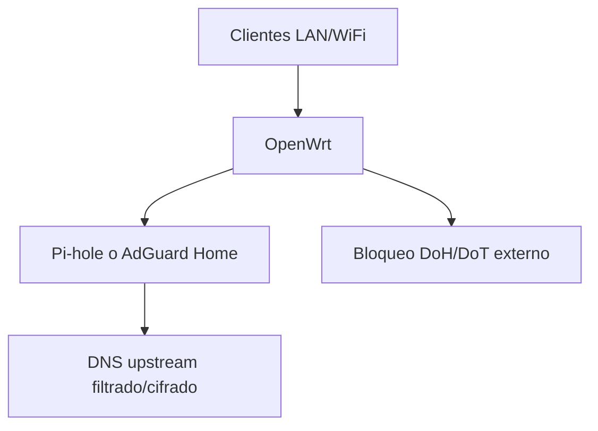

# OpenWRT IDS IPS Filtrado


> **Pregunta original:**
> 
Se me ha ocurrido esto. La ONT se conecta a un GLiNEt pero no quiero perder la red de 2,5 que tengo con 2 switchs y solo tengo un cable desde el ONT+GL.iNet+DECO --> switch 2,5gb. Los DECO necesita cable de red porque tengo asi su backhaul. Este diseño funcionaria ?
> el UTM es carisimo , da igual que sea un equipo miniPC o una solucion comercial 
> un ubuntu con ufw valdría ? 
> 
> *...y 12 preguntas de seguimiento*


---


## Respuesta


Veo el dibujo. La idea base sí puede funcionar, pero hay un detalle peligroso: si el Deco está en modo AP y queda conectado por dos caminos a la misma LAN, puedes crear un bucle de capa 2. Ahí es donde una red doméstica empieza a comportarse de forma muy rara.
---


Sí. Si el Pi-hole/AdGuard estará **fuera de OpenWrt**, yo miraría estos, en este orden:

| Opción | Facilidad | Lo bueno | Lo malo |
|---|---:|---|---|
| **Firewalla Purple / Gold SE / Gold Plus** | Muy alta | App sencilla, controles familiares, bloqueo DoH, reglas por dispositivo, buen logging | Más caro; menos “router clásico”; dependes de su ecosistema |
| **UniFi Cloud Gateway Ultra / Max** | Media-alta | Buen firewall, VLANs, reglas claras, interfaz cómoda, buen WiFi si añades AP UniFi | Algo más técnico; el filtrado DNS puede ser saltado si no haces reglas bien |
| **GL.iNet Flint 2 / GL-MT6000** | Media | Basado en OpenWrt, flexible, económico, puede usar AdGuard Home y reglas avanzadas | Sigue oliendo a OpenWrt por debajo; bloquear DoH bien requiere ajuste |
| **Synology WRX560 / RT6600ax** | Alta | Interfaz muy amigable, Safe Access para familia, perfiles por dispositivo | Menos flexible; evasiones avanzadas pueden colarse |

Mi recomendación realista: **Firewalla** si quieres lo más fácil para familia. Tiene “Family Protect” para bloquear contenido adulto/violento y documentación propia sobre DoH; además advierte que para combinar Family Protect y DoH conviene usar su modo nativo. genui{"citation":{"refs":["turn233003search17","turn233003search0"]}}

Si quieres algo más “red seria pero manejable”, iría a **UniFi Cloud Gateway Ultra/Max**. Es mejor si piensas separar red de niños, invitados, IoT, etc. Pero tendrás que configurar reglas: bloquear salida DNS `53`, DoT `853`, permitir solo tu Pi-hole/AdGuard, y bloquear DoH conocido.

Si quieres barato y flexible, **GL.iNet Flint 2** está bien, especialmente porque GL.iNet habla abiertamente de AdGuard Home y controles parentales en sus routers. genui{"citation":{"ref":"turn233003search19"}} Pero no lo elegiría si buscas “cero líos”.

**Evitaría** routers domésticos típicos TP-Link/Asus/Netgear básicos si tu requisito es serio. Suelen permitir poner DNS, pero muchos no fuerzan DNS ni bloquean DoH de forma robusta. Para control parental básico valen; para impedir evasión, se quedan cortos.

La configuración mínima que debería soportar el router elegido:

1. DHCP entregando DNS = IP de Pi-hole/AdGuard.
2. Bloquear LAN → WAN puerto `53` TCP/UDP.
3. Bloquear LAN → WAN puerto `853` TCP.
4. Permitir solo Pi-hole/AdGuard como cliente DNS hacia Internet.
5. Bloquear listas DoH conocidas.
6. Controlar IPv6 o desactivarlo si no lo vas a filtrar bien.

Mi elección corta: **Firewalla si prima facilidad; UniFi si quieres algo más profesional; GL.iNet si quieres ahorrar y no te molesta tocar configuración.**
---


No como un **mesh real tipo Deco**.

Con dos **GL.iNet Flint / Flint 2** puedes hacer cosas parecidas, pero no una malla doméstica integrada con roaming fino y gestión centralizada. En el caso del **Flint 2 GL-MT6000**, en el foro de GL.iNet responden directamente que **mesh no está soportado**. genui{"citation":{"ref":"turn171363search1"}}

Sí podrías montarlo así:

| Modo | Funciona | Comentario |
|---|---:|---|
| **AP cableado** | Sí | Mejor opción. Mismo SSID/clave en ambos, uno hace de router y el otro de punto de acceso. |
| **Repeater / Extender** | Sí | Repite por WiFi, pero pierdes rendimiento y no es mesh real. |
| **WDS** | Posible | Más técnico y dependiente de compatibilidad. |
| **Mesh tipo Deco/AiMesh** | No | No esperes roaming y gestión mesh como TP-Link Deco, ASUS AiMesh o UniFi. |

La arquitectura que yo usaría sería:

```text
ONT
 |
Flint 2 principal como router
 |
Switch / cable Ethernet
 |
Flint 2 secundario en modo AP
```

Configuras en ambos:
- mismo nombre WiFi;
- misma contraseña;
- misma seguridad, idealmente WPA2/WPA3 compatible;
- canales distintos: por ejemplo 2.4 GHz en canal 1 y 6/11; 5 GHz en canales separados.

Lo bueno: barato, estable y rápido si el segundo va cableado.  
Lo malo: el cambio entre puntos de acceso lo decide el móvil/portátil; no tendrás una experiencia mesh tan pulida como con Deco.

Mi recomendación práctica: **usa un Flint 2 como router/firewall y conserva los Deco como mesh en modo AP**. Es más limpio que comprar dos Flint esperando que hagan mesh.
---


Sí, entonces lo que necesitas es que el Deco de la zona ONT esté **en la LAN del GL.iNet**, no antes ni en paralelo raro. Ese Deco podrá ver al otro Deco para Ethernet backhaul siempre que ambos estén en la misma red local.

La topología que yo haría sería esta:

```text
ONT
 |
WAN
GL.iNet / OpenWrt
 |
LAN 2.5 Gb
 |
switch 2.5 Gb pequeño en zona ONT
 |              |
Deco zona ONT  cable al switch 2.5 principal
                |
             switch 2.5
                |
             switch 2.5
                |
             Deco remoto
```

Eso mantiene:

- WiFi Deco en la zona de la ONT.
- Backhaul cableado entre Decos.
- Red local 2.5 Gb entre switches.
- GL.iNet como router/firewall/DNS principal.
- Decos en **modo AP**.

Lo que evitaría es esto:

```text
GL.iNet -> Deco
GL.iNet -> switch
Deco   -> switch
```

Ahí puedes crear un bucle si todo está en la misma LAN.

También podrías hacer esto si no quieres comprar un switch pequeño:

```text
ONT -> GL.iNet -> Deco zona ONT -> switch 2.5 -> switch 2.5 -> Deco remoto
```

Funcionaría, pero tiene una pega: todo lo que vaya hacia los switches pasaría a través del Deco. Si los puertos del Deco son de 1 Gb, pierdes 2.5 Gb en ese tramo. Aunque sean 2.5 Gb, yo prefiero no usar el Deco como “switch troncal” principal.

Mi recomendación práctica: compra un **switch 2.5 Gb pequeño de 5 puertos** en la zona ONT/GL.iNet. Sería la pieza que ordena todo. Conectas ahí el GL.iNet, el Deco local y el cable que va al resto de la casa. Es simple y evita inventos.
---


Sí, **algo podrías hacer**, pero no confiaría en el **SPI firewall del Deco** como solución principal para bloquear DoH.

El SPI del Deco está pensado sobre todo para validar tráfico y proteger contra ciertos ataques; TP-Link lo describe como una protección de firewall/DoS, no como un firewall avanzado con reglas finas de salida por IP, dominio, puerto y usuario. genui{"citation":{"ref":"turn887356search4"}}

**Qué sí podrías hacer con Deco/HomeShield:**

- Bloquear algunos dominios o webs desde control parental.
- Usar filtros por categorías si tu modelo/plan HomeShield lo soporta.
- Configurar Pi-hole/AdGuard como DNS de la red.
- Aplicar controles por dispositivo o perfil. TP-Link documenta bloqueo de webs, filtros de contenido y límites horarios en Deco/HomeShield. genui{"citation":{"refs":["turn887356search1","turn887356search21"]}}

**Qué no esperaría que haga bien:**

- Mantener listas grandes de IPs de DoH.
- Bloquear DoH de forma fiable.
- Hacer reglas avanzadas tipo “todos los clientes solo pueden usar este DNS”.
- Redirigir todo DNS `53` al Pi-hole/AdGuard.
- Bloquear DoT `853` con granularidad.
- Detectar DoH oculto dentro de HTTPS `443`.

El problema es que **bloquear DoH por IPs y dominios es una carrera constante**. Puedes bloquear:

```text
dns.google
cloudflare-dns.com
mozilla.cloudflare-dns.com
security.cloudflare-dns.com
dns.quad9.net
dns.nextdns.io
doh.opendns.com
```

y algunas IPs conocidas, pero mañana una app puede usar otro endpoint, otra CDN o un DoH integrado. Además, si el cliente ya usa DoH, tu Pi-hole no verá la consulta DNS inicial para bloquear el dominio del resolutor.

Mi valoración clara:

| Opción | Sirve para tu objetivo |
|---|---|
| **Deco SPI firewall** | No, demasiado básico. |
| **Deco HomeShield** | Parcialmente, cómodo pero limitado. |
| **Deco + Pi-hole/AdGuard** | Mejor, pero con escapatorias DoH/DoT. |
| **Router/firewall delante del Deco** | Mucho mejor. |
| **Firewalla / OPNsense / UniFi** | La solución más seria. |

Si quieres seguir con Deco sin añadir router nuevo, haría esto:

1. Configurar Pi-hole/AdGuard como DNS DHCP.
2. Activar HomeShield/Parental Controls.
3. Bloquear manualmente dominios DoH conocidos.
4. Desactivar “DNS seguro” en Chrome/Firefox/Edge/Android/iOS si puedes.
5. Revisar logs de Pi-hole/AdGuard para ver qué dispositivos se saltan el DNS.

Pero si quieres **forzar** de verdad que nadie esquive el DNS, necesitas un router/firewall delante del Deco. En ese caso los Deco deberían ir en **modo punto de acceso**, y el firewall sería quien manda.
---


Sí: para tu objetivo, la vía correcta es **DNS filtrado + cerrar bypasses**, no IDS/IPS.

La arquitectura que usaría:



**Lo bueno**
Pi-hole o AdGuard Home pueden bloquear contenido inapropiado por categorías/listas, y OpenWrt puede obligar a la red a usar ese DNS. OpenWrt documenta el bloqueo por DNS para control parental y contenido, y también la redirección/intercepción de DNS desde firewall. genui{"citation":{"refs":["turn219123search3","turn219123search0"]}} Además, `banIP` tiene una fuente específica para bloquear DoH conocido. genui{"citation":{"ref":"turn219123search5"}}

**Lo malo**
No será perfecto. DoH va por HTTPS/443, así que un DoH nuevo o poco conocido puede parecer tráfico web normal. Tampoco bloquea contenido dentro de una web permitida, por ejemplo una página concreta dentro de Reddit, X, YouTube, etc. Para eso ya necesitas controles de cuenta, apps, MDM, proxy con certificado, o filtrado en endpoint.

Mi recomendación concreta:

1. **Usa AdGuard Home si quieres control parental fácil**
   AdGuard Home suele ser más cómodo que Pi-hole para familias: categorías, safe search, bloqueo por cliente, horarios, logs más claros. Pi-hole es excelente, pero normalmente requiere más listas y ajustes manuales.

2. **Pon el DNS filtrante en una IP fija**
   Ejemplo: `192.168.1.2`.

3. **Haz que OpenWrt entregue ese DNS por DHCP**
   En LuCI: `Network > Interfaces > LAN > DHCP Server > Advanced Settings > DHCP-Options`:

   ```text
   6,192.168.1.2
   ```

4. **Bloquea DNS directo hacia fuera**
   Bloquea desde LAN a WAN:
   - TCP/UDP `53`
   - TCP `853` para DoT

   Permite solo que el Pi-hole/AdGuard consulte DNS upstream.

5. **Intercepta DNS normal**
   Si un dispositivo intenta usar `8.8.8.8` o `1.1.1.1` por puerto 53, redirígelo al DNS filtrante. Mejor aún: pon Pi-hole/AdGuard en otra VLAN/subred para que la redirección sea limpia. Si está en la misma LAN, puede funcionar peor por el retorno directo del tráfico.

6. **Bloquea DoH conocido**
   Instala `banip` y activa la lista DoH:

   ```sh
   opkg update
   opkg install banip luci-app-banip
   uci add_list banip.global.ban_feed="doh"
   uci commit banip
   service banip restart
   ```

7. **Bloquea IPv6 o intégralo bien**
   Mucha gente configura IPv4 y se olvida de IPv6. Si tienes IPv6 activo, el DHCPv6/RA también debe anunciar tu DNS filtrante, y las reglas de firewall deben cubrir IPv6. Si no lo vas a controlar, desactívalo temporalmente.

8. **Endurece navegadores y dispositivos**
   En Chrome/Edge/Firefox desactiva “DNS seguro” o pon políticas administradas. En Firefox, bloquear el dominio canario `use-application-dns.net` ayuda a desactivar DoH automático en ciertos escenarios, aunque no conviene depender solo de eso.

Para una red doméstica, el punto dulce sería:

| Capa | Qué usar |
|---|---|
| DNS filtrado | AdGuard Home o Pi-hole |
| DNS obligatorio | DHCP + bloqueo/redirección puerto 53 |
| DoT | Bloquear `853` |
| DoH | `banIP` feed DoH + listas DNS |
| Contenido adulto | listas tipo adult/malware/safesearch |
| Evasión fuerte | controles en dispositivo además del router |

Si me dices tu hardware OpenWrt, versión, si usas IPv6 y dónde correrá Pi-hole/AdGuard, te paso una configuración UCI más exacta.
---


Sí, **funcionaría**, pero yo cambiaría una cosa del dibujo: **no conectaría el Deco a la vez al GL.iNet y al switch si ambos caminos acaban en la misma LAN**.

Eso puede crear este triángulo:

```text
GL.iNet -> Deco -> switch -> GL.iNet
```

Si el Deco está en modo AP, eso es un posible **bucle de red**. Algunos equipos lo toleran, otros no, y cuando falla lo hace de forma fea: cortes, latencia, DHCP raro, WiFi inestable.

La topología buena sería esta:

```text
ONT
 |
GL.iNet / OpenWrt
 |
switch 2.5 Gb
 |
switch 2.5 Gb
 |
Decos
```

Y si el Deco principal está físicamente junto al GL.iNet, entonces:

```text
ONT
 |
GL.iNet / OpenWrt
 |               \
 |                Deco principal en AP
 |
switch 2.5 Gb
 |
switch 2.5 Gb
 |
Deco secundario en AP
```

Pero **sin conectar también el Deco principal al switch** si ya está conectado al GL.iNet.

Lo importante:

- El **GL.iNet debe ser el router principal**.
- Los **Deco en modo Access Point / AP**, no router.
- DHCP, DNS, AdGuard/Pi-hole y reglas deben vivir en GL.iNet/OpenWrt.
- El cable del GL.iNet al primer switch debería salir por un **puerto LAN 2.5 Gb**, si el modelo lo tiene.
- Todo lo que esté entre los dos switches 2.5 seguirá hablando a 2.5 Gb entre sí.
- El tráfico hacia Internet pasará por el GL.iNet, así que ahí manda la velocidad de sus puertos y de tu fibra.

Si solo tienes **un cable** desde la zona ONT/GL.iNet hacia los switches, no pasa nada: úsalo como **troncal LAN** desde el GL.iNet al primer switch 2.5. No metas la WAN de la ONT en ese switch salvo que uses VLANs bien separadas con switches gestionables.

Mi veredicto: **sí, el diseño es viable**, pero elimina el enlace Deco-switch del triángulo o conecta todos los Decos solo detrás del switch. La versión más limpia es:

```text
ONT -> GL.iNet -> switch 2.5 -> switch 2.5 -> Decos en AP
```
---


Sí, un router con OpenWrt puede hacer **algo parecido a IDS/IPS y filtrado de contenido**, pero con límites importantes.

**Lo bueno**
OpenWrt puede usar herramientas como **Snort** para IDS/IPS; la wiki de OpenWrt lo documenta como sistema de prevención de intrusiones basado en reglas. genui{"citation":{"ref":"turn395591search6"}} También puede bloquear dominios con **Adblock** usando DNS, con listas de publicidad, abuso o malware, y es una opción bastante ligera para routers domésticos. genui{"citation":{"ref":"turn395591search2"}} Para DNS cifrado, OpenWrt soporta **DNS over HTTPS** con `https-dns-proxy`, haciendo que los clientes usen `dnsmasq` y que el router reenvíe las consultas cifradas. genui{"citation":{"ref":"turn395591search3"}}

**Lo malo**
Un router doméstico OpenWrt normalmente **no tiene CPU/RAM suficientes** para IPS serio a velocidad alta. Snort/Suricata inspeccionando mucho tráfico puede saturar el router, aumentar latencia o bajar throughput. Para IDS/IPS real suele ir mejor un mini PC, firewall x86, OPNsense/pfSense, o una máquina separada recibiendo tráfico espejo.

Sobre **HTTPS**: no puedes “ver” el contenido HTTP dentro de HTTPS sin romper TLS mediante proxy MITM e instalar un certificado raíz en todos los dispositivos. Eso es delicado, rompe apps, no funciona bien con certificate pinning, y tiene implicaciones de privacidad. Sin MITM, puedes bloquear por:

| Objetivo | OpenWrt puede hacerlo | Comentario |
|---|---:|---|
| Bloquear dominios por DNS | Sí | Lo más práctico: `adblock`, `dnsmasq`, `unbound`, listas |
| Forzar DNS local | Sí | Redirigir puerto 53 al router ayuda contra DNS manual genui{"citation":{"ref":"turn395591search17"}} |
| Usar DNS-over-HTTPS desde el router | Sí | `https-dns-proxy` |
| Bloquear DoH externo de clientes | Parcial | Puedes bloquear IPs/domains conocidos de DoH, no perfecto |
| Inspeccionar HTTP claro | Sí | Puerto 80, proxy o reglas |
| Inspeccionar contenido HTTPS | No, salvo MITM | Y no lo recomiendo salvo entorno controlado |
| IPS con reglas | Sí, limitado | Depende muchísimo del hardware |

Mi recomendación práctica: en OpenWrt usa **filtrado DNS + bloqueo de DoH externo + listas por categoría**. Para IDS/IPS serio, deja OpenWrt como router/firewall y manda una copia del tráfico a una máquina más potente con Suricata/Zeek/Wazuh. Para “bloquear contenido” en casa o pequeña oficina, DNS filtrado suele dar el 80% del resultado con mucho menos dolor.
---


Voy a distinguir dos cosas: lo que el Deco suele poder hacer con su firewall SPI y lo que haría falta para bloquear DoH de forma consistente. Ahí hay bastante diferencia práctica.
---


Tiene sentido: cuando miras UTM “de marca”, pagas hardware, licencias y comodidad, y no siempre necesitas todo eso. Voy a aterrizarlo en opciones más baratas sin venderte humo: qué se puede conseguir y qué sacrificas.
---


No lo necesitas necesariamente. Si el GL.iNet tiene suficientes puertos LAN, puedes usarlo como “switch pequeño” en esa zona.

La conexión buena sería:

```text
ONT
 |
WAN
GL.iNet
 |---------------- Deco zona ONT
 |
LAN 2.5 GbE
 |
switch 2.5 principal
 |
switch 2.5 secundario
 |
Deco remoto
```

Siempre que los puertos LAN del GL.iNet estén en la misma LAN/bridge, los dos Deco se verán para el **Ethernet backhaul**.

El switch pequeño solo tendría sentido en estos casos:

| Caso | ¿Necesitas switch 2.5 pequeño? |
|---|---:|
| Deco actual tiene solo 1GbE | No |
| Solo quieres 2.5 entre GL.iNet y switch principal | No |
| Quieres conectar varios equipos 2.5 en la zona ONT | Sí |
| Futuro Deco local con puerto 2.5 y el GL.iNet solo tiene un LAN 2.5 libre | Sí |
| Te faltan puertos LAN físicos | Sí |

Si hablamos del **GL.iNet Flint 2**, normalmente tienes 2 puertos 2.5 GbE y 4 puertos 1 GbE. Entonces haría:

```text
2.5 WAN -> ONT
2.5 LAN -> switch 2.5 principal
1G LAN  -> Deco zona ONT
```

Lo malo: el Deco local quedará limitado a 1 GbE si su puerto y/o el puerto usado son 1 GbE.  
Lo bueno: tu troncal hacia los switches ya queda a 2.5 GbE, que era justo lo que querías preparar.

La única regla importante: **no conectes el Deco local también al switch principal si ya está conectado al GL.iNet**, porque puedes crear un bucle.
---


Sí, normalmente puedes identificar el **dominio**, pero no la **URL completa**.

Ejemplo:

```text
https://www.ejemplo.com/videos/adultos/pagina.html?user=123
```

Sin inspección TLS, un router/firewall puede llegar a ver o inferir:

```text
www.ejemplo.com
```

Pero no ve:

```text
/videos/adultos/pagina.html?user=123
```

**Qué puedes ver sin romper HTTPS:**

| Dato | ¿Se puede ver? | Comentario |
|---|---:|---|
| IP destino | Sí | Siempre necesaria para enrutar. |
| Dominio por DNS | Sí, si usas DNS local sin DoH/DoT | Pi-hole/AdGuard lo ve. |
| Dominio por SNI TLS | Muchas veces sí | En HTTPS clásico, el SNI suele revelar el dominio. |
| URL completa | No | Va cifrada dentro de HTTPS. |
| Ruta, parámetros, formularios, contenido | No | Todo eso va dentro del túnel TLS. |
| Dominio con ECH activo | A veces no | ECH cifra/oculta parte del handshake, incluyendo SNI. Cloudflare explica que con ECH el intermediario puede ver el proveedor frontal, pero no necesariamente el sitio concreto. genui{"citation":{"ref":"turn107348search0"}} |

Para control parental, esto significa:

- Puedes bloquear **dominios completos**: `pornhub.com`, `reddit.com`, `tiktok.com`, etc.
- Puedes bloquear **categorías por dominio** usando Pi-hole, AdGuard, NextDNS, Firewalla, Zenarmor, etc.
- No puedes bloquear de forma fiable una **URL concreta dentro de un dominio HTTPS** sin inspección TLS.
- En sitios grandes tipo `youtube.com`, `reddit.com`, `google.com`, el filtrado por URL específica es difícil desde el router.

Para ver la URL completa haría falta **inspección TLS/HTTPS**, es decir, que el firewall actúe como proxy intermedio e instales un certificado raíz en cada dispositivo. Eso funciona en PCs gestionados, pero en casa suele ser incómodo, rompe apps, no funciona bien con muchas apps móviles y plantea temas de privacidad.

Mi recomendación para tu caso: céntrate en **dominio + DNS forzado + bloqueo DoH/DoT + SafeSearch/YouTube Restricted Mode cuando aplique**. Es el punto razonable entre eficacia y sencillez.
---


Sí, te entiendo. Si el objetivo es **bloquear contenido inapropiado + forzar DNS + cerrar DoH/DoT razonablemente**, un UTM comercial puede ser matar moscas a cañonazos.

Yo miraría estas opciones baratas:

| Opción | Coste aprox. | Lo bueno | Lo malo |
|---|---:|---|---|
| **GL.iNet Flint 2 / GL-MT6000** | Medio-bajo | OpenWrt con interfaz fácil, 2 puertos 2.5G, AdGuard Home integrado, DoH/DoT, buen equilibrio. GL.iNet documenta AdGuard Home y DNS cifrado en su firmware. genui{"citation":{"refs":["turn625844search0","turn625844search5"]}} | No es UTM real; bloqueo DoH avanzado requiere tocar reglas/listas. |
| **TP-Link Omada ER605** | Bajo | Barato, router cableado serio, VLAN, firewall, VPN, Omada. Tiene 1 WAN, 2 LAN y 2 WAN/LAN gigabit; SPI/DoS según ficha. genui{"citation":{"refs":["turn625844search8","turn625844search10"]}} | Filtrado parental/DNS bastante limitado; no es ideal contra DoH. |
| **MiniPC N100 usado/barato + OPNsense** | Medio | Mucho más potente, flexible, sin licencia obligatoria. | Más trabajo; si quieres Zenarmor completo, puede haber coste. |
| **ASUS compatible Merlin** | Medio | Fácil, WiFi incluido, DNS Director/DNSFilter en Merlin, controles familiares aceptables. | Menos firewall que OPNsense; menos fiable contra DoH/VPN. |
| **MikroTik hEX / hAP ax** | Bajo-medio | Muy potente para reglas, NAT, VLAN, DNS forzado. | Curva de aprendizaje alta; no lo llamaría sencillo. |

Para tu caso, si quieres **barato y bastante sencillo**, mi recomendación cambiaría a:

**1. GL.iNet Flint 2 como router principal**  
```text
ONT -> GL.iNet Flint 2 -> Decos en modo AP
                       -> AdGuard Home / Pi-hole
```

Es probablemente el punto más equilibrado: más control que Deco/ASUS básico, más barato que Firewalla, más simple que OPNsense.

**2. TP-Link Omada ER605 si quieres gastar lo mínimo**  
Funciona bien como router principal cableado, pero para filtrado de contenido necesitarás sí o sí Pi-hole/AdGuard aparte. No esperes magia con DoH.

**3. MiniPC N100 + OPNsense si quieres “lo correcto” sin pagar UTM comercial**  
No es caro comparado con un UTM, pero sí exige configuración. Bueno: una vez montado, es lo más serio.

Mi descarte: **Acer** y **Deco como firewall principal**. Valen para WiFi/mesh y control básico, pero no para imponer una política DNS robusta.

Si buscas la opción más sensata por precio/esfuerzo: **GL.iNet Flint 2 + Decos en AP + AdGuard Home**.
---


Sí: con Decos detrás de una ONT, yo pondría un **firewall/UTM como router principal** entre la ONT y los Deco, y dejaría los **Deco en modo AP/bridge**. Así el UTM controla toda la LAN y puedes forzar DNS hacia Pi-hole/AdGuard.

Mi recomendación, de más sencilla a más potente:

| Opción | Para ti | Lo bueno | Lo malo |
|---|---|---|---|
| **Firewalla Gold SE** | Mi recomendación si quieres facilidad | Muy fácil, app clara, 4 puertos 2.5 GbE, reglas por dispositivo, control familiar, bloqueo DNS/DoH razonable, poco mantenimiento. Firewalla indica 4 interfaces 2.5 GbE y funciones comunes en la gama Gold. genui{"citation":{"refs":["turn537507search0","turn537507search20"]}} | Menos “UTM clásico”; menos flexible que OPNsense/pfSense; dependes bastante de su ecosistema. |
| **UniFi Cloud Gateway Ultra/Max** | Buena si te gusta una interfaz limpia | Fácil, buen panel, IDS/IPS, filtrado de contenido DNS por red/VLAN/dispositivo. UniFi documenta filtrado DNS contra contenido explícito/inapropiado. genui{"citation":{"ref":"turn537507search1"}} | Menos fino para forzar políticas avanzadas de DNS/DoH que OPNsense; mejor si ya usas o quieres ecosistema UniFi. |
| **Protectli / mini PC N100 + OPNsense + Zenarmor** | La opción más completa | Muy potente: firewall real, VLANs, NAT, reglas finas, Zenarmor para categorías web/DoH/DoT. Protectli vende appliances con 2-4 puertos Intel 2.5GbE según modelo. genui{"citation":{"refs":["turn537507search5","turn537507search25"]}} | No es “muy sencillo”; requiere más configuración y mantenimiento. Zenarmor filtra HTTPS por SNI/FQDN si no haces inspección TLS. genui{"citation":{"ref":"turn537507search27"}} |

**Mi elección para tu caso:** **Firewalla Gold SE**.

Topología:

```text
ONT -> Firewalla Gold SE / UTM -> switch o Deco principal -> resto de Decos en AP mode
                         -> Pi-hole / AdGuard Home
```

Reglas que pondría:

1. DHCP del Firewalla entrega como DNS solo el Pi-hole/AdGuard.
2. Bloquear salida TCP/UDP 53 desde todos los clientes excepto Pi-hole/AdGuard.
3. Bloquear TCP 853 para DoT.
4. Activar bloqueo de DoH / “family protect” / listas de DoH conocidas.
5. En navegadores y móviles, desactivar “DNS seguro” cuando sea posible, porque bloquear DoH al 100% sin romper cosas no siempre es perfecto.

Punto importante: si tu operador exige **PPPoE, VLAN ID o clonación de MAC**, confirma que el equipo elegido lo soporta antes de comprar. Firewalla y OPNsense suelen encajar bien; con UniFi también suele ser posible, pero conviene verificarlo para tu ISP concreto.

Si quieres lo más simple: **Firewalla Gold SE**.  
Si quieres lo más controlable y no te importa aprender: **OPNsense en Protectli/N100**.  
Yo no pondría un UTM complicado solo para esto si el objetivo principal es bloquear contenido y controlar DNS.
---


Voy a mirarlo con ojos bastante prácticos: muchos routers domésticos anuncian “seguridad”, pero para tu objetivo concreto lo que importa es si pueden forzar DNS, bloquear DoH/DoT y trabajar bien con los Deco en modo AP.
---


Sí, **ASUS sí tiene un firmware bastante decente para router doméstico**, pero no lo llamaría UTM. **Acer**, en cambio, lo veo más flojo para lo que tú quieres.

**ASUS: opción razonable**
ASUSWRT trae AiProtection, controles parentales, Safe Browsing y soporte de DNS over TLS en muchos modelos. ASUS describe Safe Browsing como filtrado DNS ligero para bloquear contenido no deseado, y también documenta DoT/DNS privacy. genui{"citation":{"refs":["turn764332search12","turn764332search0"]}}

Lo bueno:
- Interfaz sencilla.
- Controles parentales aceptables.
- Puedes usar Pi-hole/AdGuard como DNS.
- Algunos modelos permiten AiMesh, VLANs limitadas, VPN, firewall básico.
- Con **Asuswrt-Merlin**, en modelos compatibles, puedes tener más control: scripts, DNSFilter/DNS Director, bloqueo más fino.

Lo malo:
- No es un UTM real.
- El control de DoH no es perfecto, porque DoH usa HTTPS `443`.
- El filtrado por categorías depende de servicios de terceros o de Trend Micro/ASUS.
- Si un dispositivo usa VPN o DoH propio, puede saltarse parte del control si no haces reglas adicionales.
- No tendrás la visibilidad de OPNsense/Zenarmor o Firewalla.

**Acer: yo no lo elegiría para esto**
Algunos Acer Predator Connect tienen “home network security” y control parental, pero por lo que se ve está más orientado a límite horario, bloqueo de URL/dispositivo y funciones de router gaming/5G. genui{"citation":{"ref":"turn764332search24"}} Para filtrado DNS serio, forzar DNS, bloquear DoH/DoT y tener reglas por red, no sería mi primera opción.

Mi ranking para tu caso sería:

| Opción | Veredicto |
|---|---|
| **ASUS compatible con Merlin** | Buena opción doméstica si quieres algo comercial y manejable. |
| **ASUS stock firmware** | Vale, pero con menos control. |
| **Acer Predator Connect** | No lo recomendaría para este objetivo. |
| **Firewalla / UniFi / OPNsense** | Mejor si quieres control de verdad. |

Si quieres ir por ASUS, miraría modelos compatibles con **Asuswrt-Merlin**, por ejemplo gamas tipo **RT-AX86U Pro**, **RT-AX88U Pro**, **GT-AX6000** o equivalentes actuales. Lo pondrías así:

```text
ONT -> ASUS router -> Decos en modo AP
                  -> Pi-hole / AdGuard
```

Y configuraría:
- DHCP entregando Pi-hole/AdGuard como DNS.
- Bloqueo/redirección de DNS `53` hacia tu DNS.
- Bloqueo de DoT `853`.
- Safe Browsing / AiProtection activado.
- Desactivar “DNS seguro” en navegadores y móviles cuando puedas.

Mi respuesta corta: **ASUS sí, Acer no**. Pero si tu prioridad es “bloquear contenido inapropiado y cerrar escapatorias DoH”, **ASUS es aceptable**, no ideal. Firewalla u OPNsense siguen siendo mejores.
---


Buena pregunta, porque aquí está la frontera real entre “filtrado DNS/domino” y “inspección profunda”. Voy a responderlo separando lo que se ve sin romper TLS de lo que solo se ve instalando certificados.
---


En general: **no de forma limpia con “rutas estáticas” del Deco**.

Una ruta estática en el Deco normalmente sirve para decir:

```text
Para llegar a la red 192.168.50.0/24, manda el tráfico a 192.168.1.10
```

Pero no sirve bien para decir:

```text
Todo el tráfico de Internet de mis clientes debe ir primero a OPNsense VM,
luego volver al Deco, y después salir por la ONT.
```

Eso sería más bien **policy-based routing**, gateway por cliente, bridge transparente o poner OPNsense como router principal.

**El problema principal:** para tráfico de Internet, los clientes ya usan como gateway el Deco. Si el Deco recibe tráfico hacia `8.8.8.8`, lo normal es que lo mande por su WAN, no a una VM interna, salvo que cambies su ruta por defecto. Y si cambias la ruta por defecto del Deco hacia OPNsense, puedes crear un bucle:

```text
Cliente -> Deco -> OPNsense VM -> Deco -> OPNsense VM -> ...
```

Además, el tráfico de vuelta puede ser asimétrico, y NAT/firewall se vuelve feo.

Las opciones viables son estas:

| Diseño | ¿Lo recomiendo? | Comentario |
|---|---:|---|
| **ONT -> OPNsense -> Deco en AP** | Sí | Es la arquitectura correcta. |
| **ONT -> Deco -> OPNsense VM -> Deco -> Internet** | No | Puede crear bucles y no filtra bien todo. |
| **OPNsense VM como bridge transparente entre ONT y Deco** | Sí, si tienes 2 NICs/VLANs | Más avanzado, pero posible. |
| **OPNsense VM solo como DNS/AdGuard/Pi-hole** | Sí | Más simple, pero no inspecciona todo el tráfico. |
| **Rutas estáticas en Deco hacia OPNsense para todo** | No | No es la herramienta adecuada. |

La forma buena sería:

```text
ONT
 |
OPNsense VM / appliance
 |
Deco principal en modo AP
 |
LAN / WiFi
```

Para hacerlo con una VM necesitas idealmente:

- 2 interfaces físicas dedicadas, o
- 1 interfaz física con VLANs bien separadas:
  - VLAN WAN hacia ONT
  - VLAN LAN hacia Deco/switch

OPNsense tendría:

```text
WAN -> ONT
LAN -> Deco/switch
```

Y los Deco en **Access Point mode**, sin NAT ni DHCP principal.

Si no quieres tocar tanto, alternativa intermedia:

```text
ONT -> Deco router
        |
        +-> VM con AdGuard/Pi-hole
```

Ahí solo fuerzas DNS lo mejor posible desde Deco/HomeShield, pero aceptando que DoH/VPN pueden saltárselo.

Mi consejo: no intentaría “mandar y devolver” tráfico al Deco con rutas estáticas. Si vas a montar OPNsense, que sea **el router principal** o **un bridge transparente real**. Todo lo demás suele acabar siendo más frágil que útil.
---


Sí, **podría valer**, pero con matices importantes.

Un **Ubuntu con UFW** te sirve como **router/firewall básico** entre la ONT y la LAN:

```text
ONT -> Ubuntu -> Deco en modo AP -> LAN
              -> Pi-hole / AdGuard
```

Lo bueno:

- Es barato si ya tienes un mini PC con 2 o más interfaces.
- Puedes hacer NAT, reglas firewall, bloqueo de puertos DNS externos, redirección DNS, VPN, logs, etc.
- Puedes instalar Pi-hole/AdGuard en el propio Ubuntu o en otra máquina.
- Puedes añadir Suricata/Zeek, pero ya no sería “sencillo”.

Lo malo:

- **UFW no es un UTM**. Es una capa cómoda encima de iptables/nftables.
- Para routing + NAT + reglas de forwarding, UFW se vuelve algo menos cómodo que OPNsense.
- El bloqueo de DoH no es trivial: puedes bloquear DoT por puerto `853`, forzar DNS clásico, bloquear listas conocidas de DoH, pero DoH va por HTTPS `443`, así que no se puede distinguir siempre sin inspección o listas.
- La gestión por interfaz web, categorías, reportes y perfiles familiares será mucho peor que Firewalla/UniFi/OPNsense+Zenarmor.

Mi opinión: **Ubuntu + UFW vale si te gusta administrar Linux**. Para una casa y “quiero que funcione y sea fácil”, no sería mi primera opción.

Si aun así lo haces, el mínimo razonable sería:

1. Ubuntu Server con 2 NICs: `WAN` hacia ONT, `LAN` hacia Deco/switch.
2. Activar IP forwarding.
3. NAT/masquerade para la LAN.
4. DHCP en Ubuntu o en AdGuard Home.
5. UFW: permitir LAN, bloquear entrada WAN.
6. Forzar DNS:
   - permitir DNS solo hacia Pi-hole/AdGuard;
   - bloquear `53` hacia Internet;
   - bloquear `853`;
   - bloquear listas de resolvers DoH conocidos.
7. Decos en **Access Point mode**, no router mode.

Para tu caso concreto, yo lo pondría así:

| Opción | Mi valoración |
|---|---|
| **Ubuntu + UFW** | Válido, barato, flexible, pero más manual. |
| **OPNsense** | Mejor que Ubuntu para router/firewall dedicado. |
| **Firewalla Gold SE** | Más fácil para control familiar y DNS. |
| **UniFi Gateway** | Fácil y ordenado, algo menos fino que OPNsense. |

Si quieres sencillez real: **Firewalla**.  
Si quieres hacerlo tú con control y sin pagar ecosistema: **OPNsense antes que Ubuntu+UFW**.  
Ubuntu lo usaría más si ya dominas Linux o quieres aprender.
---


Sí, esa idea tiene sentido: usar el **GL.iNet como router** y que el enlace hacia tu red de switches pase ya a **2.5 GbE**, aunque los Deco actuales sigan limitados a 1 GbE.

La topología que mejor encaja sería:

```text
ONT
 |
WAN 2.5/1G
GL.iNet
 |
LAN 2.5 GbE
 |
switch 2.5 GbE pequeño en zona ONT
 |              |
Deco local      cable hacia switch 2.5 principal
                |
             switch 2.5
                |
             switch 2.5
                |
             Deco remoto
```

Así consigues:

- El **GL.iNet manda**: NAT, DHCP, DNS, AdGuard, bloqueo DNS/DoH razonable.
- El enlace `GL.iNet -> switch 2.5` ya queda preparado a **2.5 GbE**.
- El Deco local da WiFi en la zona ONT.
- Los Deco se ven por LAN para **Ethernet backhaul**.
- Cuando cambies los Deco por modelos con puertos 2.5 GbE, no tienes que rehacer la estructura.

Lo bueno: es una arquitectura limpia y preparada para futuro.  
Lo malo: necesitas un **switch 2.5 GbE pequeño** junto a ONT/GL.iNet, porque si usas el Deco como paso intermedio puedes volver a limitarte a 1 GbE o crear una topología más frágil.

Si hablas del **GL.iNet Flint 2 / GL-MT6000**, tiene dos puertos 2.5 GbE: uno WAN y otro WAN/LAN configurable. Lo normal sería:

```text
2.5 WAN  -> ONT
2.5 LAN  -> switch 2.5
```

Y los Decos en **modo AP**. Esa sería, para mí, la opción más sensata sin meterte en UTM caro.
---


Voy a separar dos cosas que a veces se mezclan: routers fáciles para “forzar DNS externo” y routers que además bloquean DoH de forma cómoda. Ahí hay diferencias reales, y no todos los comerciales lo hacen bien.
---


Voy a contrastar opciones actuales y, sobre todo, separar “UTM real” de “router fácil con control DNS”, porque para tu caso esa diferencia importa más que la etiqueta comercial.
---


Voy a aterrizarlo en una arquitectura práctica: bloquear contenido por DNS propio y cerrar las vías habituales para saltárselo, especialmente DoH/DoT. También revisaré lo bueno y lo malo para que no quede una falsa sensación de “bloqueo perfecto”.
---


Voy a comprobarlo porque en GL.iNet la palabra “mesh” depende mucho del firmware y del modelo: no siempre significa lo mismo que Deco/AiMesh.

---
*Generado desde conversación con 39 mensajes.*
*General*
