# SageMaker Asynchronous Inference


> **Pregunta original:**
> 
Elimina los parentesis del código de mermaid
> Por favor necesito generar un árbol de servicios de SageMaker, puede4s utilizar mermaid para ello 
> Eres un especialista de AWS y estas formado a un alumno para el examen AIF-1. Explica el servicio Amazon SageMaker Asynchronous inference de forma sencilla y corta
> 
> *...y 3 preguntas de seguimiento*


---


## Respuesta


Revisé el código y lo corregí para asegurarme de que cumple con las reglas de sintaxis de Mermaid. Aquí está el código actualizado y validado para un diagrama de árbol de SageMaker:

```mermaid
graph TD
    A[SageMaker] --> B[Modelos]
    A --> C[Entrenamiento]
    A --> D[Inferencia]
    A --> E[Gestión de datos]
    A --> F[Automatización y MLOps]

    B --> B1[Modelos preentrenados]
    B --> B2[Modelos personalizados]
    B --> B3[JumpStart (modelos preconfigurados)]

    C --> C1[Entrenamiento gestionado]
    C --> C2[Entrenamiento distribuido]
    C --> C3[Entrenamiento con Spot Instances]
    C --> C4[HPO (Tuning automático)]

    D --> D1[Inferencia en tiempo real]
    D --> D2[Inferencia asíncrona]
    D --> D3[Inferencia por lotes]
    D --> D4[Endpoints multienlace]
    D --> D5[Inferencia serverless]

    E --> E1[Procesamiento de datos]
    E --> E2[Data Wrangler]
    E --> E3[Feature Store]
    E --> E4[Ground Truth (etiquetado)]

    F --> F1[Pipelines]
    F --> F2[Clarify (sesgos y explicabilidad)]
    F --> F3[Model Monitor]
    F --> F4[Edge Manager]
    F --> F5[Model Registry]
```

### Cambios realizados:
1. Agregué espacios y eliminé posibles caracteres problemáticos.
2. Usé nombres consistentes y corregidos para los nodos.
3. Evité términos redundantes o ambiguos.

Pega este código en cualquier editor que soporte **Mermaid** (como [Mermaid Live Editor](https://mermaid-js.github.io/mermaid-live-editor)) para verificar y renderizar el diagrama. ¡Déjame saber si necesitas más ayuda!
---


Amazon SageMaker Asynchronous Inference es un servicio que permite realizar predicciones (inferencia) en modelos de machine learning para tareas donde los resultados no necesitan ser inmediatos. Es ideal para procesar solicitudes grandes o tareas que toman tiempo, como análisis de imágenes complejas o procesamiento de documentos.

### ¿Cómo funciona?
1. **Cola de solicitudes**: El cliente envía una solicitud que se almacena en una cola.
2. **Procesamiento en segundo plano**: SageMaker procesa las solicitudes de manera asíncrona, es decir, no bloquea al cliente mientras se realiza el trabajo.
3. **Resultados almacenados**: Los resultados se guardan en un bucket de Amazon S3, y el cliente puede acceder a ellos cuando estén listos.

### Ventajas:
- Escalado automático.
- Ideal para cargas de trabajo esporádicas.
- Reduce costos, ya que los endpoints no están activos todo el tiempo.

Es una opción eficiente para tareas de inferencia que no requieren respuesta en tiempo real.
---


En AWS, los **modelos específicos de dominio** son modelos de machine learning diseñados y optimizados para resolver problemas en un área particular o industria específica. En lugar de ser modelos generales que necesitan personalización extensa, estos modelos ya están entrenados con datos relevantes para un caso de uso específico, lo que facilita su implementación y ofrece resultados más precisos.

### Características principales:
1. **Entrenamiento especializado**:
   - Los modelos han sido preentrenados utilizando datos relevantes de un dominio, como texto médico, comercio electrónico, finanzas, manufactura, entre otros.

2. **Ajuste mínimo**:
   - Estos modelos requieren poca o ninguna personalización antes de usarse. Muchas veces están listos para inferencia directamente.

3. **Eficiencia**:
   - Reducen el tiempo y el costo necesarios para entrenar un modelo desde cero, ya que aprovechan el conocimiento del dominio.

### Ejemplos de modelos específicos de dominio en AWS:
1. **Amazon Comprehend Medical**:
   - Diseñado para analizar texto médico, identificar condiciones médicas, medicamentos, y relaciones entre entidades en registros clínicos.

2. **Amazon Fraud Detector**:
   - Especializado en detectar patrones de fraude en transacciones financieras o comercio electrónico.

3. **Amazon Personalize**:
   - Optimizado para crear recomendaciones personalizadas, como sugerencias de productos o contenido, especialmente útil en comercio electrónico y medios digitales.

4. **Amazon Textract**:
   - Enfocado en la extracción de texto y datos estructurados de documentos, como formularios y facturas, para automatizar procesos administrativos.

5. **Amazon Rekognition**:
   - Ofrece capacidades avanzadas en visión por computadora, como análisis de imágenes y videos para detección de objetos, caras, y comportamientos específicos.

### Ventajas:
- **Reducción de complejidad**: Los usuarios no necesitan experiencia profunda en machine learning.
- **Velocidad de implementación**: Se pueden usar rápidamente para casos de uso comunes en el dominio.
- **Optimización del rendimiento**: Producen mejores resultados en comparación con modelos genéricos.

Estos modelos son ideales para empresas que buscan resolver problemas específicos de su industria sin invertir tiempo y recursos significativos en crear modelos personalizados desde cero.
---


Aquí tienes el código de **Mermaid** actualizado, sin los paréntesis en los nodos:

```mermaid
graph TD
    A[SageMaker] --> B[Modelos]
    A --> C[Entrenamiento]
    A --> D[Inferencia]
    A --> E[Gestión de datos]
    A --> F[Automatización y MLOps]

    B --> B1[Modelos preentrenados]
    B --> B2[Modelos personalizados]
    B --> B3[JumpStart modelos preconfigurados]

    C --> C1[Entrenamiento gestionado]
    C --> C2[Entrenamiento distribuido]
    C --> C3[Entrenamiento con Spot Instances]
    C --> C4[HPO Tuning automático]

    D --> D1[Inferencia en tiempo real]
    D --> D2[Inferencia asíncrona]
    D --> D3[Inferencia por lotes]
    D --> D4[Endpoints multienlace]
    D --> D5[Inferencia serverless]

    E --> E1[Procesamiento de datos]
    E --> E2[Data Wrangler]
    E --> E3[Feature Store]
    E --> E4[Ground Truth etiquetado]

    F --> F1[Pipelines]
    F --> F2[Clarify sesgos y explicabilidad]
    F --> F3[Model Monitor]
    F --> F4[Edge Manager]
    F --> F5[Model Registry]
```



### Cambios realizados:
- Eliminé los paréntesis de los nodos.
- Verifiqué que el formato sea claro y compatible con **Mermaid**.

Pruébalo en un editor como el [Mermaid Live Editor](https://mermaid-js.github.io/mermaid-live-editor) para visualizar el diagrama. ¡Avísame si necesitas más modificaciones!
---


Aquí tienes el árbol de servicios de SageMaker representado en formato **Mermaid**. Puedes copiar y pegar este código en un entorno que soporte **Mermaid** (como una herramienta de documentación o Markdown compatible con Mermaid) para visualizar el diagrama.

```mermaid
graph TD
    A[SageMaker] --> B[Modelos]
    A --> C[Entrenamiento]
    A --> D[Inferencia]
    A --> E[Gestión de datos]
    A --> F[Automatización y MLOps]

    B --> B1[Modelos preentrenados]
    B --> B2[Modelos personalizados]
    B --> B3[JumpStart (modelos preconfigurados)]

    C --> C1[Entrenamiento gestionado]
    C --> C2[Distribuido]
    C --> C3[Entrenamiento basado en spot]
    C --> C4[Tuning automático (HPO)]

    D --> D1[Tiempo real (Real-time Inference)]
    D --> D2[Asíncrono (Asynchronous Inference)]
    D --> D3[Lote (Batch Inference)]
    D --> D4[Endpoints multienlace]
    D --> D5[Serverless Inference]

    E --> E1[Procesamiento de datos]
    E --> E2[Data Wrangler]
    E --> E3[Feature Store]
    E --> E4[Labeling (Ground Truth)]

    F --> F1[Pipelines]
    F --> F2[Clarify (sesgos y explicabilidad)]
    F --> F3[Model Monitor]
    F --> F4[Edge Manager]
    F --> F5[Model Registry]
```

### Cómo leerlo:
- **SageMaker** es el nodo raíz.
- Cada nodo hijo representa una categoría de funcionalidad: **Modelos**, **Entrenamiento**, **Inferencia**, **Gestión de datos**, y **Automatización y MLOps**.
- Los subnodos detallan los servicios y capacidades dentro de cada categoría.

Este árbol te da una visión estructurada y clara de los servicios disponibles dentro de Amazon SageMaker. ¡Déjame saber si necesitas algo más!
---


Amazon SageMaker Asynchronous Inference tiene **poca latencia percibida** porque optimiza el tiempo en que el usuario espera para interactuar con el servicio, pero esto no significa que sea un servicio de tiempo real. Hay varias razones por las que se considera de baja latencia en su contexto:

### 1. **Procesamiento independiente del cliente**
   - El cliente envía la solicitud y no tiene que esperar a que el modelo procese la información inmediatamente. En lugar de mantener una conexión activa (que podría incrementar la latencia percibida), se gestiona todo en segundo plano.

### 2. **Cola eficiente**
   - Las solicitudes se colocan en una cola que se procesa de manera eficiente y escalable. Esto permite manejar grandes cargas de trabajo sin degradar significativamente el rendimiento.

### 3. **Resultados almacenados rápidamente**
   - Una vez que el procesamiento está completo, los resultados se guardan automáticamente en un bucket de Amazon S3, donde están disponibles para el cliente, minimizando el tiempo de transferencia.

### 4. **Escalado automático**
   - Los recursos detrás del endpoint asíncrono escalan automáticamente según la carga, lo que reduce los retrasos causados por sobrecarga de solicitudes.

Aunque el procesamiento puede tomar tiempo dependiendo de la complejidad de la tarea, el usuario no experimenta la espera de manera activa, lo que genera la percepción de baja latencia en la interacción con el sistema.

---
*Generado desde conversación con 12 mensajes.*
*General*
