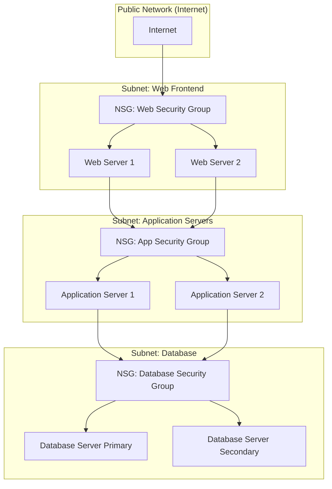

# Lenguajes para diagramas de red


> **Pregunta original:**
> 
Si
> que leguaje exiten para hacer diagramas de red
> puedes generar un ejemplo de un diagrama de red con 3 sub redes , una para frontal web , otra para un servidor de aplicaciones  y otra de base de datos, adema sindica los network security groups

---


## Respuesta


Aquí tienes el diagrama generado. Representa tres subredes (frontend, aplicaciones y base de datos) con sus respectivos Network Security Groups y conexiones. Si necesitas ajustes o más detalles, avísame. 😊
---


Aquí tienes el diagrama de red generado con las especificaciones que proporcionaste. Si necesitas ajustes o más detalles, no dudes en decírmelo. 😊
---


Existen varios lenguajes, herramientas y notaciones para crear diagramas de red, cada uno con sus propias características y enfoques. A continuación, se presentan algunos de los lenguajes y estándares más utilizados:

---

### **Lenguajes específicos para diagramas de red**
1. **Graphviz (DOT Language):**
   - Un lenguaje de descripción de gráficos muy popular para crear diagramas de red, gráficos jerárquicos, etc.
   - Sintaxis basada en texto.
   - Ejemplo:
     ```dot
     digraph G {
         A -> B;
         B -> C;
         C -> A;
     }
     ```

2. **Mermaid.js:**
   - Una herramienta basada en JavaScript que utiliza un lenguaje de marcado para generar diagramas, incluidos diagramas de red.
   - Puede integrarse fácilmente en sitios web y documentos Markdown.
   - Ejemplo:
     ```mermaid
     graph TD;
         A-->B;
         B-->C;
         C-->A;
     ```

3. **PlantUML:**
   - Un lenguaje de marcado basado en texto para diagramas, incluidos diagramas de red.
   - Compatible con varios entornos de desarrollo y herramientas de documentación.
   - Ejemplo:
     ```plantuml
     @startuml
     [Server] --> [Database]
     [Database] --> [Client]
     @enduml
     ```

4. **D3.js:**
   - Una biblioteca de JavaScript que permite crear gráficos interactivos, incluidos diagramas de red, mediante manipulación del DOM y SVG.
   - Más adecuado para programadores con conocimientos en JavaScript.

---

### **Herramientas con notaciones estándar**
1. **UML (Unified Modeling Language):**
   - Aunque se usa más comúnmente para modelar sistemas, se puede emplear para diagramas de red.
   - Incluye diagramas de despliegue y componentes que son útiles para representar redes.

2. **BPMN (Business Process Model and Notation):**
   - Aunque está diseñado para modelar procesos empresariales, puede adaptarse para flujos de red y dependencias.

3. **Cisco Icons y notaciones personalizadas:**
   - Cisco proporciona iconos específicos para diagramas de red que se usan ampliamente en diseño de topologías.
   - No es un lenguaje como tal, pero es un estándar en la industria.

---

### **Lenguajes para simulación y modelado avanzado**
1. **NS-3 o OMNeT++:**
   - Herramientas de simulación que utilizan lenguajes para modelar redes y analizar su rendimiento.
   - Se enfocan más en simulación que en diagramas estáticos.

2. **YAML o JSON para definir redes en software:**
   - Utilizados para definir infraestructura como código (por ejemplo, en Terraform, Ansible o Kubernetes).
   - Aunque no son visuales, permiten modelar redes y luego generar diagramas a partir de ellas.

---

### **Herramientas gráficas complementarias**
Aunque los lenguajes mencionados son útiles para generar diagramas programáticamente, muchas herramientas gráficas como **Microsoft Visio**, **Lucidchart**, **Draw.io (Diagrams.net)** o **Gliffy** también soportan la creación de diagramas de red utilizando estándares predefinidos o plantillas. Algunas de estas herramientas también permiten importar/exportar en lenguajes como DOT o PlantUML.

Si necesitas ayuda con alguno de estos lenguajes o ejemplos específicos, ¡puedo proporcionártelos! 😊
---


Aquí tienes un ejemplo de cómo representar un diagrama de red con tres subredes y Network Security Groups (NSGs), utilizando **Mermaid.js** como lenguaje de marcado:



### Explicación del Diagrama:
1. **Subnet Web (Frontend):**
   - Contiene dos servidores web (Web Server 1 y Web Server 2).
   - Asociado a un **NSG_Web** que filtra el tráfico permitido desde Internet (por ejemplo, permitiendo solo tráfico HTTP/HTTPS).

2. **Subnet App (Application):**
   - Contiene dos servidores de aplicaciones (Application Server 1 y 2).
   - Asociado a un **NSG_App** que filtra el tráfico permitido únicamente desde la subred web.

3. **Subnet DB (Database):**
   - Contiene dos servidores de base de datos (Primary y Secondary).
   - Asociado a un **NSG_DB** que filtra el tráfico permitido solo desde la subred de aplicaciones.

4. **Internet:**
   - Simula la red pública (Internet), conectada a la subred de frontend web a través del NSG_Web.

---

### Puedes visualizar este diagrama copiando el código en una herramienta compatible con **Mermaid.js**, como [Mermaid Live Editor](https://mermaid-js.github.io/mermaid-live-editor/).

¿Te gustaría un ejemplo más visual o convertir este en una imagen directa? 😊

---
*Generado desde conversación con 7 mensajes.*
*IA/ML*
