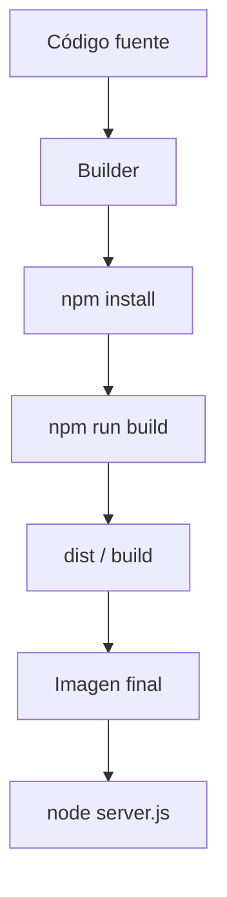

# Compilación Node con Docker


> **Pregunta original:**
> 
Estaba viendo un vídeo de cómo compilar una aplicación de node y empaquetarla en docker. Había una fase de builder en la que se compila, aquí ya me llamó la atención , y cometa que svelt buscaba que fuera más compatible , esto no se lo que es , y al final se genera una un server.js dentro de la carpeta dist y está está la carpeta que se copiaba dentro el contenedor. No habría código fuente y node_modules . No sé qué es lío que está haciendo 
> Cuando haces un app en node y la ejecutas como n node mi app.js , que estoy haciendo diferente ?

---


## Respuesta


Cuando haces:

```bash
node mi-app.js
```

estás arrancando **directamente el archivo fuente** con Node.

Es decir:

```text
tu código JS -> Node lo interpreta/ejecuta
```

No hay fase previa de build obligatoria. Node lee `mi-app.js`, carga los `require`/`import`, usa `node_modules`, y empieza a ejecutar.

En cambio, en el ejemplo de Docker con Svelte/SvelteKit ocurre algo más así:

```text
código fuente Svelte/TS/etc -> build -> dist/server.js -> Node ejecuta server.js
```

La diferencia principal es que `server.js` no suele ser el archivo que escribiste tú a mano, sino un **resultado generado**.

| Caso | Qué ejecuta Node | Hay build antes | Necesita código fuente |
|---|---|---:|---:|
| `node mi-app.js` | tu archivo original | No necesariamente | Sí |
| `node dist/server.js` | archivo generado | Sí | No necesariamente |

Por ejemplo, si tu app Node es simple:

```js
// mi-app.js
console.log("Hola");
```

puedes ejecutarla tal cual:

```bash
node mi-app.js
```

Pero si tu app usa cosas que Node no ejecuta directamente, como:

```svelte
<h1>Hola {nombre}</h1>
```

o TypeScript:

```ts
const port: number = 3000;
```

o imports/estructura que necesitan empaquetado, entonces antes hay que transformarlo a JavaScript ejecutable por Node o por el navegador.

Lo bueno de `node mi-app.js`: es simple, directo, fácil de entender.

Lo malo: para producción puedes acabar llevando todo el proyecto, dependencias de desarrollo, código fuente, archivos innecesarios, etc.

Lo bueno del build: genera una salida más limpia, optimizada y fácil de desplegar.

Lo malo: añade una capa de complejidad. Ya no ejecutas “lo que escribiste”, sino “lo que el build produjo”. Por eso al principio se siente como una caja negra.
---


Lo que viste seguramente era un **Docker multi-stage build** para una app Node, probablemente con **SvelteKit** o algo parecido.

La idea general es esta:



En la fase **builder** se mete todo lo necesario para construir la app:

- código fuente
- `package.json`
- `node_modules`
- compilador/bundler: Vite, Svelte, TypeScript, etc.
- herramientas de build

Ahí se ejecuta algo como:

```bash
npm run build
```

Y eso genera una salida final, por ejemplo:

```text
dist/
  server.js
  assets/
  ...
```

Luego, en la imagen final de Docker, se copia solo esa salida construida:

```dockerfile
COPY --from=builder /app/dist ./dist
```

Así el contenedor final no necesita llevar todo el proyecto original.

**Qué significa que “Svelte busca que sea más compatible”**

Probablemente hablaban de que Svelte/SvelteKit no ejecuta directamente tus archivos `.svelte` en producción. Durante el build los transforma a JavaScript más estándar, optimizado y preparado para correr en un entorno concreto.

En SvelteKit, además, existe el concepto de **adapter**. Por ejemplo:

- `adapter-node`: genera una app Node ejecutable, normalmente con un `server.js`.
- `adapter-static`: genera archivos estáticos HTML/CSS/JS.
- adapters para Vercel, Netlify, Cloudflare, etc.

Entonces “más compatible” puede referirse a generar una salida que Node pueda ejecutar fácilmente dentro de Docker.

**Por qué no hay código fuente ni `node_modules`**

Esto puede ser bueno porque:

- la imagen final pesa menos
- hay menos superficie de ataque
- no expones el código fuente completo dentro del contenedor
- el despliegue es más limpio
- no metes dependencias de desarrollo como TypeScript, Vite, linters, etc.

Pero ojo: no siempre desaparece todo `node_modules`. Depende de cómo esté configurado el build. Algunas apps generan un bundle casi autosuficiente; otras necesitan copiar también dependencias de producción.

Por ejemplo, una imagen final podría tener:

```text
dist/
package.json
node_modules/   # solo producción
```

o podría tener solo:

```text
dist/
server.js
```

si el bundler empaquetó lo necesario.

**En simple**

No están “compilando Node” como si fuera C o Go. Están **construyendo la aplicación**: transforman Svelte/TypeScript/módulos modernos en archivos JavaScript finales que Node o el navegador pueden ejecutar.

El Dockerfile suele separar dos mundos:

| Fase | Tiene | Para qué sirve |
|---|---|---|
| Builder | código fuente, dev dependencies, compiladores | crear la versión final |
| Runtime | solo lo necesario para ejecutar | correr la app en producción |

La parte importante: el `server.js` de `dist` no es el código que tú escribiste tal cual, sino una **salida generada** preparada para producción. Ahí está “el lío”: Docker no está haciendo magia, solo está usando una fase pesada para fabricar una carpeta final pequeña y luego corriendo esa carpeta en otra imagen más limpia.

---
*Generado desde conversación con 4 mensajes.*
*Programación*
